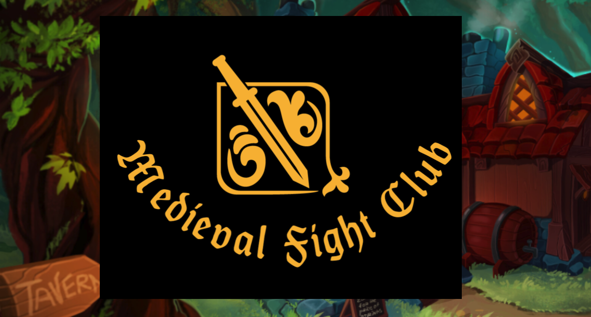
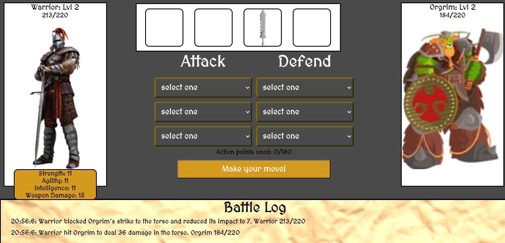

# **Medieval Fight Club**

## *by Vlad Kim*

## 1v1 RPG style arena
________________________
Inspired by Warcraft 3, Neverlands (browser RPG) and Fight Club. Your heroe's journey begins when he stumbles upon an infamous tavern. No one know what happens in the basement of this tavern but there are rumors.
They call it Medieval Fight Club, but they are not supposed to talk about it!
Warriors and wizards from all kingdoms travel to participate in tournament in hopes of defeating the grand wizard!

### Level Up
* Defeat peasants and low ranking warriors to collect expirience and coins.
* Collect weapon and armor from defeating bosses to enchance your combat abilities
____________________
## *Choose your style*
### Choose how you want to distribute your attributes to create a unique warrior
  * Strength
  * Agility
  * Intelligence

________
## Screen Shots

________
## Win Conditions

Defeat final boss and claim the title of the champion!

# Do you have what it takes?

Do it!

> How much can you know about yourself if you've never been in a fight?

>This is your life and it's ending one minute at a time.

# If you're in, you only need to know 8 rules

## Credits 
### Artwork
Outside Tavern image
https://www.instagram.com/oixxoart/
Inside Tavern image
https://www.pinterest.com/ArtStation_HQ/_created/
Wizards 
https://www.shutterstock.com/image-vector/old-wise-magician-fantasy-wizard-collection-1628087842
Bouncer
https://www.shutterstock.com/image-vector/viking-animated-character-front-side-back-1604312365
Warriors
https://www.shutterstock.com/image-vector/fighters-knight-warriors-wizards-samurai-martial-669940837
Orcs
https://www.shutterstock.com/image-vector/warrior-orcs-collection-1034894929
Roman soldier
https://www.shutterstock.com/image-vector/roman-officer-character-creation-animation-ancient-1616104702
Potions
https://opengameart.org/content/potions-set-01
Staff
https://opengameart.org/content/magic-staffs-set-1
Swords
https://opengameart.org/content/3d-swords-pack
Misc artwork
https://opengameart.org/
Armor images
https://neverlands.ru
Avatar
https://www.cleanpng.com/free/knight.html

